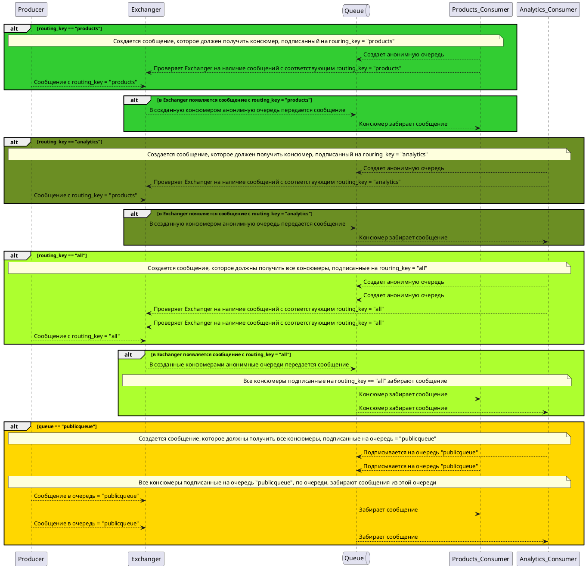

# Реализация отправки сообщений с помощью брокера сообщений RabbitMQ

В данной реализации продюсер создает:
* exchanger с именем `routing`
* добавляет в этот exchanger два `routing_key` - "both" и "paymentsonly"
  * сообщения с `routing_key` == "both" попадает во все консюмеры,
  * сообщения с `routing_key` == "paymentsonly" попадает только в консюмер который слушает соответствующий `routing_key`
* декларируется очередь по имени `byturn`, которую слушают все консюмеры, но берут сообщения из очереди по очереди

Консюмеры:
* user_consumer:
  * подключен к exchanger `routing` и слушает два `routing_key` - "useronly" и "both"
  * подписан на очередь "byturn"

* analytics_consumer:
  * подключен к exchanger `routing` и слушает два `routing_key` - "analyticsonly" и "both"
  * подписан на очередь "byturn"

* payments_consumer:
  * подключен к exchanger `routing` и слушает два `routing_key` - "paymentsonly" и "both"
  * подписан на очередь "byturn"

Таким образом продюсер может:
* отсылать сообщения напрямую в нужный консюмер указав нужный `routing_key` (useronly, analyticsonly, paymentsonly)
* отсылать сообщения которые попадут во все консюмеры если они все слушают одинаковый `routing_key` (both)
* отсылать сообщения в очередь, из котороый консюмеры, подписанные на эту очередь, будут брать сообщения по очереди

